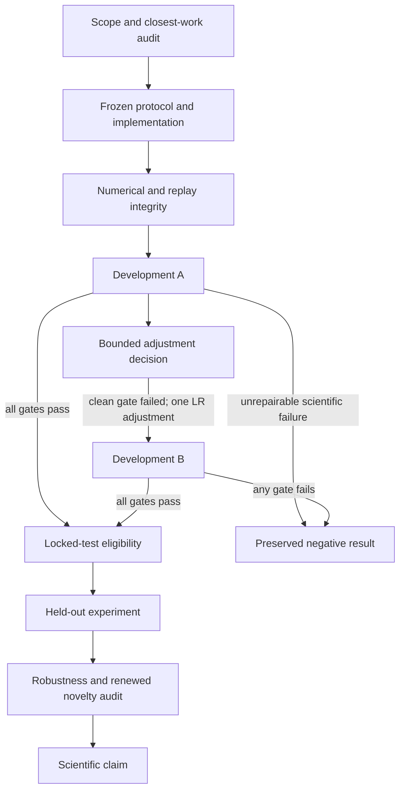

# Research dependency graph

A node's output is evidence for its declared acceptance condition only. A numerical success does not satisfy a scientific gate. Main is the sole integration writer; a successor takes that role explicitly rather than editing a running experiment.

| Node | Objective and exact inputs | Sole output owner and outputs | Acceptance | Downstream evidence |
| --- | --- | --- | --- | --- |
| N0 | Corrected RL mandate; closest sources linked in THESIS.md | Research lead: docs/research/THESIS.md | Genuine RL question; excluded-project overlap removed; Tandem/AltNet collision explicit | Permits only the narrow reversal question, not novelty priority |
| N1 | N0; docs/research/PROTOCOL.md; configs/development.json | Integration lead: src/, tests/, pyproject.toml, uv.lock | Actual learner, oracle-separated simulator, frozen gates, no paid execution | Defines exact treatment and numerical semantics |
| N2 | N1 source; configs/smoke.json | Verification lead: two sentinel directories and reports/verification.json | Behavioral regressions; exact semantic sentinel reproduction; all diagonal traces checked | Permits development, not a positive RL result |
| N3 | N2; frozen configuration A and code | One experiment runner: results/development-a only | Every planned pair completed; artifact audit passes; all raw curves and gates retained | Supplies development A gate values |
| N4 | N3's immutable summary and protocol adjustment rule | Research lead: docs/research/DECISIONS.md | State cause before action; no threshold change; no hidden data access | Authorizes at most the specified LR-only B, or stops |
| N5 | Authorized N4; configuration B differing only in learning_rate | One experiment runner: results/development-b only | Same six pairs, same frozen gates, verified artifacts | Supplies final bounded-development decision |
| N6 | Passing N3 or N5; verified config/code/input/output bindings | Research lead: locked config and decision record | All three preliminary gates pass; structural/learner seeds disjoint; code and core settings unchanged | Authorizes locked evaluation only |
| N7 | N6; frozen locked configuration; passing prerequisite run | One experiment runner: one new held-out run directory | Complete planned grid; integrity audit; interval-supported opposing effects assessed explicitly | Evidence about held-out reversal in this small family |
| N8 | N7; Tandem RL, AltNet, optimizer/replay controls | Research lead: robustness report and refreshed closest-work ledger | Effect not just constructed coverage, optimizer reset, or a single toy seed; contribution not subsumed | Supports a narrowly scoped scientific claim |
| N9 | All required N8 evidence | Sole human author: claim ledger/manuscript | Every assertion cites an accepted artifact; limitations retained | Publication, not automatic promotion from a test pass |

## Ownership and concurrency

- Structural-seed computations are independent only after the common configuration and source are frozen. Parallel workers must own disjoint pair artifacts; one integrator alone writes the aggregate JSONL, summary and final manifest. The launch runner is intentionally serial.
- Source, protocol and gate changes are serialized. Never edit learning code while a run is being interpreted as a current-source checkpoint.
- Literature research and read-only review may run alongside a frozen experiment. Artifact verification is read-only.
- No two writers share a results directory. A new attempt always uses a new directory; the CLI refuses an existing directory, including an empty one.

## Reusable checkpoint contract

A reusable result is the tuple `(source binding, exact config hash, runtime versions/thread settings, output inventory, semantic digest, numerical status, scientific gate)`. The dependency lock and locally committed protocol supply the surrounding execution context. Aged NPZ checkpoints contain online/target parameters, Adam moments/clocks, and replay rows/UID state. `load_checkpoint` checks the expected learning fingerprint; callers must also verify the enclosing artifact inventory.

A matching checkpoint is not permission to reuse its conclusion under a different source version, setting, seed split, or failed prerequisite. The held-out CLI checks source equality and core settings against the accepted development run. Hashes provide reproducibility/integrity checks, not independent signatures or proof against an adversary who rewrites every artifact.

## Stop propagation

Any failed integrity node blocks all scientific descendants until a diagnosed engineering repair is verified. Any failed final development scientific gate blocks N6–N9. It does not erase N0–N5 or make their negative measurements invalid. The final launch state and exact successor action live in ../HANDOFF.md and DECISIONS.md; this file defines the graph rather than inventing completed nodes.

## Final launch state

N2 was reopened when review found a missing step-zero score comparison. Repair commit 6d1dbb6 and 66 passing tests close that engineering gap. The separately bound `results/sentinel-v2-a/b` and `results/development-a-v2` / `results/development-b-v2` attempts revalidate the complete contract; original directories remain historical outputs of their earlier source version. A/B scientific semantic digests are unchanged.

N3 and N5 are numerically complete but their scientific acceptance fails. N4's single LR adjustment is consumed. N6–N9 remain blocked. The guard repair does not change a scientific gate or authorize another configuration.
